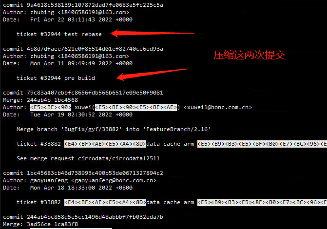
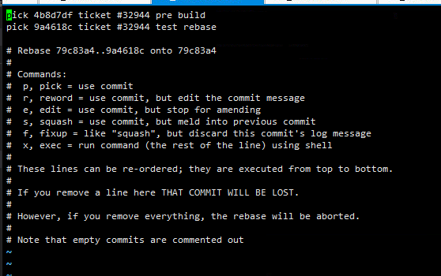
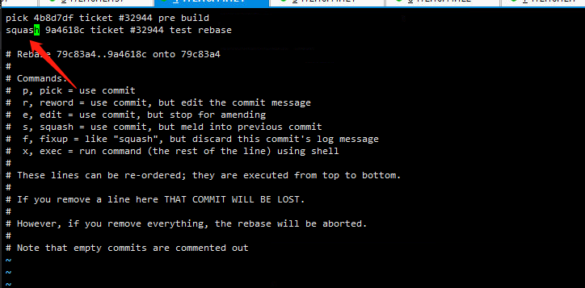
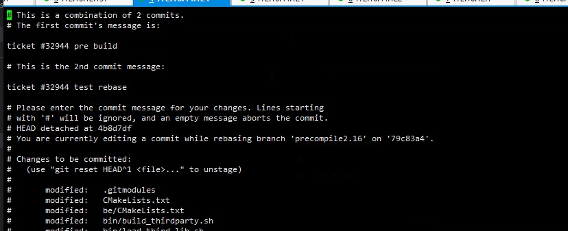
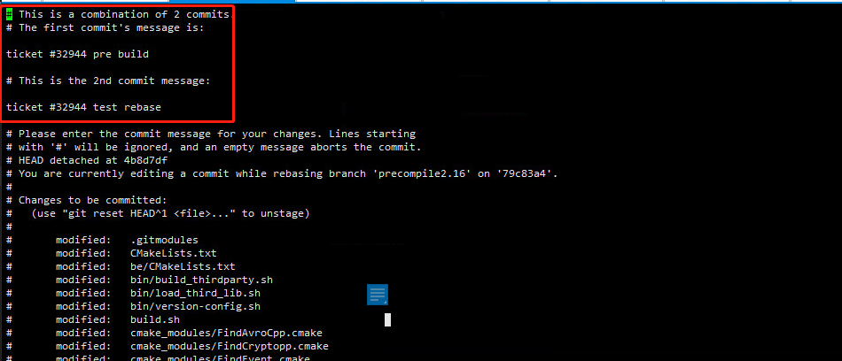
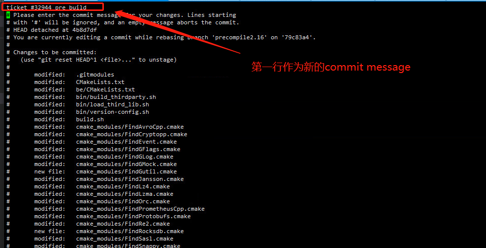
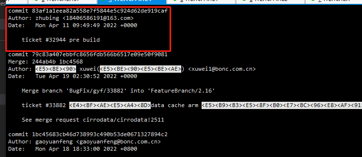

1. git rebase -i HEAD~2
之后会进入一个编辑界面，他会以提交顺序倒序排列

2. 修改pick为squash，此处修改第二个pick为squash，表示将下面的commit都压缩到第一个commit，修改完成后保存退出。

3. 退出后将进行自动压缩，如果期间产生冲突，则解决冲突，解决完之后执行：
 git add .
 git rebase --continue
 如果想放弃压缩，则执行：
 git rebase --abort

4. 自动压缩完成后将跳到另一个可编辑页面，用来修改commit信息

 做修改：
 

 之后git log会发现已经压缩为一个commit
 

 5. 如果之前的两次提交已经push到了远端，则压缩之后无法直接push，会被拒绝，因为你压缩之后你的commit在远端的commit之前了，这时你如果确定你修改的没问题了，可以使用
  git push -f -u origin <分支名>
