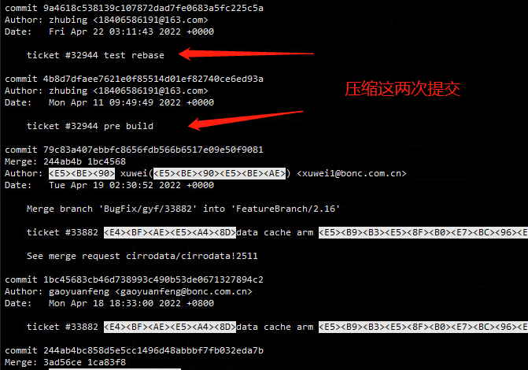
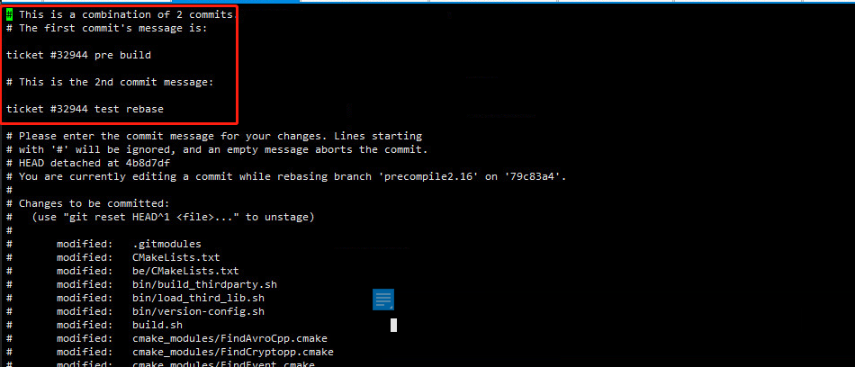
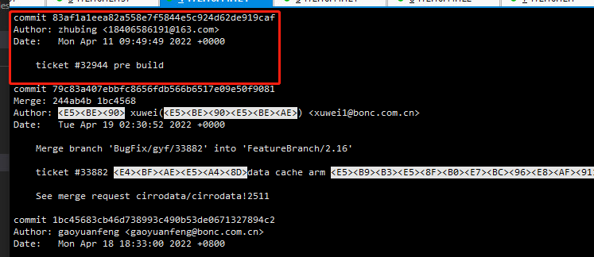

### gitlab架构
Consul 服务发现
Gitaly 用于处理所有的git调用，rpc请求
Puma 处理web接口和api调用的请求
Sidekiq 后台作业处理器

### gitlab配置
vim /etc/gitlab/gitlab.rb

   external_url 'http://172.16.12.1:8082'
   unicorn['listen'] = '127.0.0.1'
   unicorn[''port'] = 8082
   nginx['listen_addresses'] = ['*']
   nginx['listen_port'] = 82

vim /var/opt/gitlab/gitlab-rails/etc/gitlab.yml
   host: 172.16.12.1
   port: 82

 vim /var/opt/gitlab/gitlab-rails/etc/puma.rb
   bind 'tcp://127.0.0.1:8082'

vim /var/opt/gitlab/nginx/conf/gitlab-http.conf
   server {
	#listen *:80;
	listen *:82;
   server_name 172.16.12.1;
 vim /var/opt/gitlab/gitlab-shell/config.yml
   gitlab_url: "http://127.0.0.1:8082"

gitlab-ctl reconfigure (切记在这一步执行完之后会将puma.rb和config.yml文件重置，，需要再按上面修改，否则会报502)
   #重新启动
   gitlab-ctl restart
 数据存储目录
   /data1/gitlab-data

   主备同步脚本
   gitdata_sync.sh

   主备同步完成后需要修改一处配置否则无法启动(报502)
  vim /var/opt/gitlab/gitlab-shell/config.yml
   gitlab_url: "http://127.0.0.1:8082"
   

### git碰到的问题记录
1. git rebase branchname 与 git merge branchname
rebase 会把当前分支基于origin的修改作为一个补丁，应用到要合并的分支上，比如：
在当前分支zb上执行git rebase master，会先更新到master的最新然后把zb最新的修改作为一个patch，先保存在.git/batch下，然后应用到分支上，使看起来像没有合并一样

发生冲突后：rebase解决完冲突，要git add 冲突文件，然后需要执行git rebase --continue 执行之后会弹框让你修改信息，修改完之后你的最后一次提交的提交信息就变成修改之后的信息。
merge 再修改完冲突后得提交一次，作为解决冲突的提交，

2. 需要修改前面某个版本的commit信息,假如第三次
- git rebase -i HEAD~3
- 将pack改为edit
- git commit --amend 修改信息
- git rebase --continue
- 完成

3. git merge 当没有分叉时默认进行快进式合并，只移动指针，会把这些commit都带着，除非加 git merge --no-ff显示禁止，但是当有分歧，则无法进行快进式合并，则会生成一个merge提交。

## 压缩提交

1. git rebase -i HEAD~2
之后会进入一个编辑界面，他会以提交顺序倒序排列

2. 修改pick为squash，此处修改第二个pick为squash，表示将下面的commit都压缩到第一个commit，修改完成后保存退出。

3. 退出后将进行自动压缩，如果期间产生冲突，则解决冲突，解决完之后执行：
 git add .
 git rebase --continue
 如果想放弃压缩，则执行：
 git rebase --abort

4. 自动压缩完成后将跳到另一个可编辑页面，用来修改commit信息

 做修改：
 

 之后git log会发现已经压缩为一个commit
 

 5. 如果之前的两次提交已经push到了远端，则压缩之后无法直接push，会被拒绝，因为你压缩之后你的commit在远端的commit之前了，这时你如果确定你修改的没问题了，可以使用
  git push -f -u origin <分支名>

